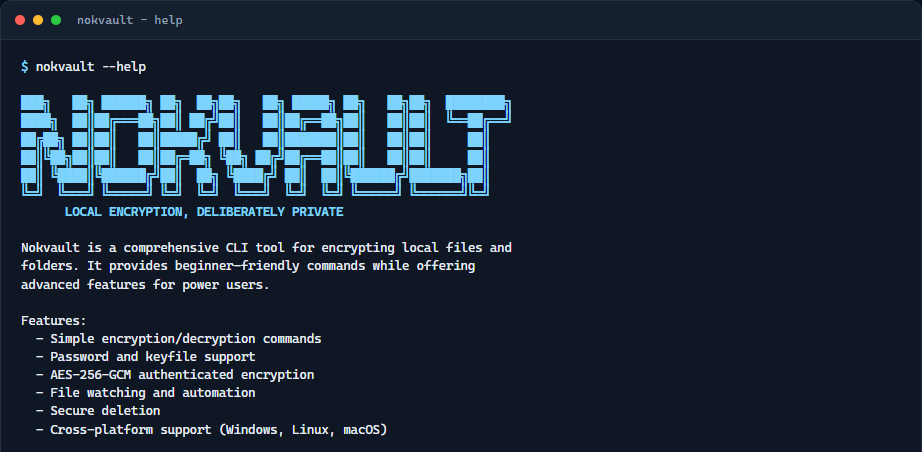

# Nokvault

[](https://golang.org/)
[](LICENSE)
[](https://github.com/jimididit/nokvault/actions)
[](https://github.com/jimididit/nokvault/releases)



A modern, feature-rich CLI tool for encrypting local files and folders. Built with Go for cross-platform support (Windows, Linux, macOS).

## Features

- **🔒 Strong Encryption**: AES-256-GCM authenticated encryption with Argon2id key derivation
- **📋 Format v3**: New vaults use bounded-memory, age-style STREAM encryption with authenticated headers and metadata; v1/v2 files still decrypt. Default extension is `.nokv` (legacy `.nokvault` still decrypts). Wire layout: [`docs/format-v2.md`](docs/format-v2.md)
- **📁 Directory Support**: Encrypt entire directories recursively with metadata preservation
- **🔑 Flexible Authentication**: Interactive password, keyfile, or `NOKVAULT_PASSWORD` (CLI `--password` refused)
- **⚡ Auto-Encryption**: Watch directories and automatically encrypt files on change
- **🔄 Key Rotation**: Re-key files by decrypting and re-encrypting with a new password
- **🗑️ Secure Deletion**: Overwrite files multiple times before deletion
- **📦 Compression**: Optional streaming gzip recorded by an authenticated v3 header flag
- **⚙️ Configuration**: Global and per-project configuration files (`key_derivation` applies to new encryptions)
- **🛡️ Crash-safe writes**: Encrypt/rotate use temp+fsync+rename; decrypt clamps modes to owner-only unless `--preserve-mode`
- **🚫 Default-deny paths**: Symlinks, Windows junctions, and other reparse points are rejected on file-touching commands; directory outputs stay inside the selected root
- **📊 Progress Tracking**: Visual progress bars for operations
- **⌨️ Responsive CLI identity**: Interactive root help uses a polished terminal-aware wordmark; version, redirected, and JSON output stay automation-safe
- **🌐 Cross-Platform**: Single binary for Windows, Linux, and macOS

## Quick Start

### Installation

**Download pre-built binaries:**

```bash
# Visit https://github.com/jimididit/nokvault/releases
# Download the binary for your platform
```

Release binaries published after provenance support was enabled include SHA-256
checksums and a GitHub build attestation. Verify the downloaded binary with:

```bash
gh attestation verify ./nokvault-linux-amd64 --repo jimididit/nokvault
```

Compare its SHA-256 digest with the accompanying `checksums.txt` before running
it. Replace the filename above with the artifact for your platform.

**Or build from source:**

```bash
git clone https://github.com/jimididit/nokvault.git
cd nokvault
# Windows
go build -o nokvault.exe ./cmd/nokvault

# Linux/macOS
go build -o nokvault ./cmd/nokvault
```

**Package managers:**

```bash
# Homebrew (macOS)
brew tap jimididit/nokvault https://github.com/jimididit/nokvault.git
brew install jimididit/nokvault/nokvault

# Scoop (Windows)
scoop install https://raw.githubusercontent.com/jimididit/nokvault/main/scoop/nokvault.json
```

An APT repository is not currently published. Linux users should download the
attested binary for their architecture from GitHub Releases.

### Basic Usage

```bash
# Encrypt a file
nokvault encrypt document.txt

# Decrypt a file
nokvault decrypt document.txt.nokv

# Encrypt a directory
nokvault encrypt ./documents

# Use a keyfile
nokvault encrypt file.txt --keyfile ~/.keys/master.key

# Watch and auto-encrypt
nokvault watch ./documents --auto-encrypt --keyfile ~/.keys/master.key

# Schedule periodic encryption
nokvault schedule encrypt ./backups --interval 1h

# Rotate encryption key
nokvault rotate-key file.nokv

# Securely delete a file (non-interactive needs --yes)
nokvault secure-delete sensitive-file.txt --yes

# Preview secure-delete targets
nokvault secure-delete ./secrets --dry-run
```

## Commands

| Command | Description |
| --------- | ------------- |
| `encrypt <path>` | Encrypt a file or directory (`--force` to overwrite outputs). Rejects symlink/reparse inputs and outputs. |
| `decrypt <path>` | Decrypt a nokvault encrypted file (`--force`, `--strict`). Same path policy as encrypt. |
| `watch <path>` | Watch directory for changes and optionally auto-encrypt. Symlink roots and events are rejected. |
| `schedule encrypt <path>` | Schedule periodic encryption operations. Re-validates the tree on every run. |
| `rotate-key <path>` | Rotate encryption key for a file. Rejects symlink/reparse inputs. |
| `secure-delete <path>` | Securely delete (`--yes` / `--dry-run`). Refuses symlink/reparse paths and does not follow them. |
| `config` | Initialize or inspect Argon2id settings for new encryptions |

### Machine-readable output

Operational commands support a stable schema-version-1 `--json` mode:

```bash
nokvault encrypt evidence.img --keyfile ./key --no-prompt --json

nokvault watch ./incoming --auto-encrypt --keyfile ./key --no-prompt --json |
  jq -c 'select(.event == "encryption.completed")'
```

`encrypt`, `decrypt`, `secure-delete`, and `rotate-key` emit exactly one JSON result or error object. `watch` and `schedule encrypt` emit newline-delimited JSON lifecycle and operation events. In operational JSON mode, stdout contains JSON only, stderr stays empty, prompts and progress bars are disabled, and failures return a nonzero exit code with a structured error. Consumers should ignore unknown fields; breaking field changes require a new schema version.

## Configuration

Initialize the supported Argon2id configuration:

```bash
nokvault config --init
```

View current settings:

```bash
nokvault config --show
```

Configuration files:

- Global: `~/.config/nokvault/config.toml`
- Local: `.nokvault.toml` (in current directory)

## Advanced Usage

**Compression:**

```bash
nokvault encrypt large-file.bin --compress
```

**Use environment variable:**

```bash
export NOKVAULT_PASSWORD="your-password"
nokvault encrypt file.txt --no-prompt
```

**Watch directory with auto-encrypt:**

```bash
nokvault watch ./sensitive --auto-encrypt \
  --keyfile ~/.keys/master.key \
  --delay 5s \
  --exclude "*.tmp"
```

**Dry run:**

```bash
nokvault encrypt ./files --dry-run
```

**Verbose output:**

```bash
nokvault encrypt ./files -v
```

## Known Limitations

- **`protect` command**: Hidden because archive mode is not implemented. Direct invocation fails without touching the supplied path. Use `encrypt` for files or directories.
- **Linux packaging**: An APT repository is not currently available. Download attested Linux binaries from [GitHub Releases](https://github.com/jimididit/nokvault/releases).
- **Edge cases**: Some edge cases may need additional testing. Please report any issues you encounter.
- **No-replace filesystem support**: Race-safe encrypt/decrypt writes without `--force` require hard-link support on the destination filesystem. FAT/exFAT and some network filesystems may reject the operation; choose a supported destination rather than weakening overwrite protection.
- **No symlink follow opt-in**: There is no `--follow-symlinks` flag. Use a regular file or directory path instead of a link.
- **Windows reparse points**: `Lstat`-visible symlinks and `ModeIrregular` entries are rejected, as are paths with readable reparse attributes (junctions, and some cloud placeholders or volume mount points). If `GetFileAttributes` fails on an ordinary-looking path, that component cannot be conclusively classified.
- **Concurrent path replacement**: Validation uses `Lstat` before open. A privileged local attacker who replaces a path component between those steps is outside this policy; descriptor-relative OS APIs are not used.

## Security

- **Encryption**: AES-256-GCM authenticated encryption
- **Key Derivation**: Argon2id with configurable parameters (persisted in format v2/v3 headers)
- **Streaming format**: New encryptions write format v3 with 64 KiB AES-GCM STREAM chunks and bind the exact header and metadata bytes as AAD
- **Format spec**: On-disk header and AEAD framing are documented in [`docs/format-v2.md`](docs/format-v2.md)
- **Memory Safety**: Sensitive data zeroized after use
- **Atomic encrypt writes**: Temp file + fsync + rename
- **Decrypt modes**: Clamped to ≤0600 / ≤0700 unless `--preserve-mode`
- **Path policy**: Default-deny for detected symlinks, Windows junctions, and other reparse points on encrypt, decrypt, rotate-key, secure-delete, watch, schedule, and keyfiles. Nested-link rejection applies only to commands that recurse. Directory outputs are contained with lexical `SafeJoin` (`filepath.Rel`, not string-prefix matching).
- **Policy errors**: `SYMLINK_DISALLOWED` (use a regular path; links are not followed) and `PATH_ESCAPE` (stay inside the selected output directory). Checks run before `--dry-run`, password prompts, reads, writes, or deletes.
- **File Integrity**: Built-in AES-GCM authentication tags (decrypt fails closed on tamper)

### Security Best Practices

1. **Use keyfiles** instead of passwords when possible (`chmod 0600`; symlinks are rejected)
2. **Never pass passwords on argv** - `--password` / `-p` are refused
3. **Rotate keys** periodically using `rotate-key`
4. **Use secure deletion** for sensitive files: `secure-delete --yes` (or confirm interactively); preview with `--dry-run`
5. **Never commit** passwords or keyfiles to version control
6. **Prefer keyfiles over** `NOKVAULT_PASSWORD` for automation (env vars remain visible to local processes)
7. **Pass `--force`** when intentionally overwriting encrypt/decrypt outputs
8. **Use regular paths** - replace any symlink or junction with the real file or directory; Nokvault will not follow it

## Contributing

Contributions are welcome!

1. Fork the repository
2. Create a feature branch (`git checkout -b feature/amazing-feature`)
3. Make your changes and add tests
4. Ensure all tests pass: `go test ./...`
5. Commit your changes (`git commit -m 'Add amazing feature'`)
6. Push to the branch (`git push origin feature/amazing-feature`)
7. Open a Pull Request

Please ensure code follows Go conventions and includes appropriate tests.

## License

This project is licensed under the MIT License - see the [LICENSE](LICENSE) file for details.

## Documentation

📚 **[Full Documentation Website](https://jimididit.github.io/nokvault/)** - Cipher Editorial landing page and docs shell with dual themes, local search, self-hosted typography, and no third-party analytics or GitHub widget runtime. Source lives under `docs/`.

For local preview:

```bash
cd docs
npm ci
npm run build
npm run preview
```

## Support

- **Issues**: [GitHub Issues](https://github.com/jimididit/nokvault/issues)
- **Discussions**: [GitHub Discussions](https://github.com/jimididit/nokvault/discussions)

---

Made with ❤️ using Go
